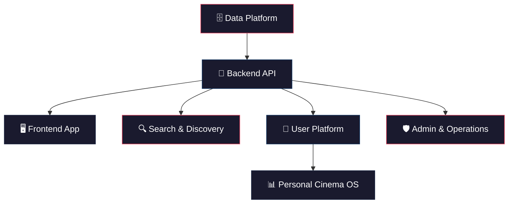

# 🎬 Cinema Platform — Product Discovery Analysis

**Document Status:** Discovery Phase — Awaiting Client Answers Before PRD  
**Date:** July 20, 2026  
**Prepared by:** Product & Engineering Team

---

## 1. Vision Understanding

### What We Heard

You want to build a **next-generation cinema knowledge platform** — not a clone of anything that exists, but a new category of product that combines:

| Dimension | Description |
|-----------|------------|
| **Database** | A comprehensive, globally-scaled movie knowledge graph (rivaling TMDB/IMDb in data depth) |
| **Personal OS** | A user's lifelong cinema archive — every film they've watched, rated, listed, and reflected on |
| **Discovery Engine** | An intelligent, enjoyable system for finding movies (not just search — actual *discovery*) |
| **Premium Experience** | A handcrafted, cinematic-feeling interface that users genuinely want to return to |

### What Makes This Ambitious

This vision simultaneously tackles **four products** that incumbents each do separately:

- **IMDb** → encyclopedic data
- **Letterboxd** → personal diary + social
- **JustWatch** → streaming availability
- **Netflix/Spotify recommendations** → intelligent discovery

Combining all four into one coherent, premium product is the core bet — and the core risk.

---

## 2. Competitive Landscape Analysis

### Platform Comparison Matrix

| Platform | Strengths | Weaknesses | Opportunity for Us |
|----------|-----------|------------|-------------------|
| **IMDb** | Massive database (10M+ titles). Industry standard. Deep credits/trivia. | Cluttered, ad-heavy UI. No meaningful personal tracking. Feels like 2010. Amazon-owned — user data serves commerce. | Build the data depth users trust, with a UI they actually enjoy. |
| **Letterboxd** (30M+ users, ~$250M valuation) | Beautiful social experience. Logging culture. Strong community. Gen Z adoption. Recently launched TVOD store. | "Joke review" culture drowning serious criticism. Free tier is limiting. No streaming availability data. Discovery is list-driven, not intelligent. TV support is weak. | Offer deeper personalization, better discovery, and a review system that rewards quality. |
| **TMDB** | Best open API for movie data. Community-maintained. Clean design. | Not a consumer-facing product for most users. No personal features. Volunteer-dependent for data quality. | Use as a data source, not a competitor. |
| **Trakt** | Excellent tracking (movies + TV). Calendar integration. Scrobbling (auto-detect). | Niche audience. UI feels utilitarian. Weak discovery. | Borrow the tracking depth, wrap it in a premium experience. |
| **JustWatch** | Best-in-class streaming availability. Price comparison. | Single-purpose — no personal library, no community, no deep data. UI is functional, not inspiring. | Integrate streaming data as a feature, not the whole product. |
| **Rotten Tomatoes** | Brand recognition for scores. Audience vs. Critic split. | Controversial scoring methodology. Superficial data. No personal features. Warner Bros.-owned bias concerns. | Offer more nuanced rating systems. |

### The Gap No One Fills

**No platform today combines deep data + personal cinema archive + intelligent discovery + premium UX in a single product.**

Users currently juggle 3-4 apps: IMDb for credits, Letterboxd for logging, JustWatch for "where to watch," and their streaming app for actual viewing. This fragmentation is the opportunity.

---

## 3. User Personas

### Primary Personas

#### 🎯 The Cinephile (Core Target — 25-45, high engagement)
- Watches 3-5+ films/week
- Cares about directors, cinematographers, film movements
- Wants deep metadata: filming locations, aspect ratios, color palettes
- Currently frustrated with Letterboxd's superficial review culture
- **Needs:** Deep data, serious reviews, powerful discovery, personal statistics
- **Willingness to pay:** High — already pays for Letterboxd Pro

#### 🎯 The Collector (High retention — 20-40)
- Builds meticulous lists and rankings
- Wants to track *everything*: watch dates, rewatches, viewing format (theater vs. streaming)
- Obsesses over personal statistics and year-in-review
- **Needs:** Granular tracking, beautiful statistics, export capabilities
- **Willingness to pay:** High

#### 🎬 The Casual Discoverer (Largest addressable market — 18-55)
- Watches 1-3 films/week
- Core problem: "What should I watch tonight?"
- Overwhelmed by streaming catalogs
- Doesn't want to build lists — wants smart recommendations
- **Needs:** Fast, enjoyable discovery. Mood-based suggestions. Where-to-watch.
- **Willingness to pay:** Low-medium — needs a compelling free tier

#### 📝 The Critic / Reviewer (Content creator — 20-45)
- Writes substantive reviews (500+ words)
- Wants their reviews to be found and valued
- Frustrated by one-liner joke reviews getting more visibility
- **Needs:** Review quality ranking, audience, formatting tools
- **Willingness to pay:** Medium

#### 👨‍👩‍👧‍👦 The Family Coordinator (Niche but loyal — 30-50)
- Needs to find age-appropriate content
- Wants shared watchlists with partner/family
- Values content warnings and parental guidance
- **Needs:** Family profiles, content filtering, shared lists
- **Willingness to pay:** Medium

#### ⚡ The Power User / Data Enthusiast (Small but vocal — 25-40)
- Wants API access, data exports, advanced filters
- Builds personal dashboards and analyses
- May contribute data corrections
- **Needs:** API, bulk export, advanced query capabilities
- **Willingness to pay:** High

---

## 4. Feature Analysis & Prioritization

### Feature Tiers

| Tier | Features | Rationale |
|------|----------|-----------|
| **MVP** | Movie/TV database with search · User accounts · Watchlist · Watched/rating tracking · Movie detail pages · Basic discovery (trending, popular, top-rated) · Responsive design | Must prove core value: "Can I find movies and track what I've watched?" |
| **V1** | Advanced search & filters · Personal statistics ("My Films") · Custom lists · Reviews · Streaming availability · Collections/franchises · Social basics (follow users, activity feed) | Parity with Letterboxd basics + streaming data advantage |
| **V2** | Intelligent Movie Picker · Mood-based discovery · Recommendations engine · Year-in-review · Achievements · Advanced statistics · Notifications · Mobile optimization | Differentiation features that create "magic moments" |
| **Future** | AI-powered natural language search · Community features (clubs, discussions) · Content creator tools · API for developers · Family profiles · Internationalization · Native mobile apps | Scale and ecosystem expansion |
| **Experimental** | AR movie poster scanning · Theater check-in · Watch party integration · Film journal/essay publishing · Filmmaker tools | Validate with user research before committing |

---

## 5. Sub-Project Identification

This is not one project. It is at minimum **six interconnected products**:

| Sub-Project | Scope | Complexity | Dependencies |
|-------------|-------|------------|-------------|
| **Data Platform** | Ingestion pipelines, normalization, image processing, sync scheduling | High | External APIs (TMDB, etc.) |
| **Backend API** | Auth, CRUD, business logic, rate limiting, caching | High | Data Platform |
| **Search & Discovery** | Full-text search, filters, recommendations, trending | Very High | Data Platform, User data |
| **Frontend Application** | All UI, interactions, animations, responsive design | Very High | Backend API |
| **User Platform** | Auth, profiles, tracking, lists, reviews, social | High | Backend API |
| **Personal Cinema OS ("My Films")** | Statistics, timelines, achievements, year-in-review | Medium-High | User Platform |
| **Admin & Operations** | Dashboard, moderation, monitoring, analytics | Medium | Backend API |

---

## 6. Risk Analysis

### 🔴 Critical Risks

| Risk | Impact | Likelihood | Mitigation |
|------|--------|-----------|------------|
| **TMDB Licensing** | If TMDB changes terms or pricing, the entire data layer breaks. Letterboxd itself depends on TMDB — a single point of failure for the ecosystem. | Medium | Negotiate commercial license early. Build abstraction layer to support multiple data sources. Consider contributing to TMDB community. |
| **Scope Creep** | The vision describes 4+ major products. Building all simultaneously = shipping nothing. | Very High | Ruthless MVP scoping. Ship the core loop first. |
| **"Cold Start" Problem** | An empty platform with no users, no reviews, no community feels dead. Unlike TMDB, we don't have community contributors from day one. | High | Pre-populate with data. Focus on personal value (tracking) before social value (community). |
| **Image Rights & CDN Costs** | Movie posters and backdrops are copyrighted. TMDB allows hotlinking their CDN, but terms could change. Self-hosting millions of images is expensive. | Medium | Use TMDB CDN with proper attribution per their terms. Budget for eventual image hosting migration. |

### 🟡 Significant Risks

| Risk | Impact | Mitigation |
|------|--------|------------|
| **Recommendation Quality** | Bad recommendations = users don't trust the system. Building a good rec engine requires significant user data. | Start with popularity/trending. Layer in collaborative filtering after sufficient user base. Don't oversell AI in MVP. |
| **Performance at Scale** | Millions of movies × millions of users = massive query complexity, especially for statistics. | Design for read-heavy workloads from day one. Precompute statistics. Aggressive caching. |
| **Review Moderation** | User-generated reviews attract spam, toxicity, and low-quality content. | Reputation system. Rate review quality. Report/flag system. Start with curated community. |
| **Legal: Streaming Availability Data** | JustWatch guards their data aggressively. No reliable free API for "where to watch." | Evaluate TMDB's watch providers data (limited but legal). Consider JustWatch partnership. Or defer this feature. |
| **Monetization Uncertainty** | Without a clear revenue model, the project may not be sustainable. | Define monetization strategy early (freemium, ads, affiliate links to streaming services). |

### 🟢 Manageable Risks

| Risk | Mitigation |
|------|------------|
| **Technology selection paralysis** | Follow the principle: simplest architecture that supports the vision. Decide based on requirements, not trends. |
| **Accessibility compliance** | Bake WCAG 2.2 AA into the design system from day one, not as an afterthought. |
| **SEO for movie pages** | Server-side rendering for movie detail pages is non-negotiable for discoverability. |

---

## 7. Hidden Opportunities We Identified

### 💡 Opportunities Not in Your Brief

| Opportunity | Why It Matters | Complexity |
|-------------|----------------|-----------|
| **"Where I Left Off" Cross-Platform Tracking** | No platform tracks which episode you're on across Netflix, Disney+, etc. Users manually track this. Solving it — even manually — creates daily habit. | Low (manual) to Very High (auto-detect) |
| **Cinematographer / Composer / Editor Discovery** | Every platform treats directors and actors as primary. Cinephiles care about Roger Deakins, Hans Zimmer, Thelma Schoonmaker. Surfacing below-the-line talent is a differentiator. | Low — just better metadata display |
| **Taste Profile as Identity** | Letterboxd proved that movie taste is identity for Gen Z. Go further: generate a shareable "cinema DNA" card — your top genres, decades, countries, directors as a visual identity. | Medium |
| **"Film School" Discovery Paths** | Curated journeys: "The History of Noir," "Essential Japanese Cinema," "Kubrick's Visual Language." Not just lists — guided learning paths with context. | Medium |
| **Theatrical Release Calendar + Reminders** | "This film you watchlisted releases in your city on Friday." Bridges the gap between online tracking and real-world viewing. | Medium |
| **Dual Rating System** | Let users rate both "quality" (how good is it objectively?) and "enjoyment" (how much did I personally enjoy it?). Solves the perennial "5-star Schindler's List but I don't *enjoy* watching it" problem. | Low |
| **Collaborative Watchlists** | "Movie night with friends" — shared lists where everyone adds candidates and votes. Social feature that drives group adoption. | Medium |

---

## 8. Assumptions We're Challenging

### ⚠️ Ideas That Need Scrutiny

| Assumption in Brief | Our Challenge | Why This Matters |
|---------------------|---------------|-----------------|
| **"Tinder-like swipe for movies"** | Swipe-to-discover has been tried many times (Tinder for movies, MovieSwipe, etc.) and consistently fails for movies. Movies are not binary yes/no decisions — they're contextual. You don't want the same movie on a Tuesday night vs. a Saturday with friends. | Building a swipe UI that *feels* fun but *performs* poorly at discovery wastes significant engineering effort. We should prototype and validate before committing. |
| **"Millions of movies from day one"** | TMDB has ~950K movies. Many are obscure entries with no poster, no synopsis, no cast. Showing low-quality entries degrades the premium feeling. | We should curate aggressively for MVP. Quality > quantity. Filter entries without minimum metadata thresholds. |
| **"Personal cinema operating system"** | This metaphor is powerful but risks over-engineering. If "My Films" becomes too complex, casual users bounce. | The personal features must have a progressive complexity curve: simple for casuals, deep for power users. The same feature (e.g., watch tracking) should work at both levels. |
| **"Achievements and gamification"** | Gamification can feel patronizing to serious cinephiles. "Congratulations! You watched 5 horror movies!" may alienate the core audience. | Achievements should be *insightful*, not gamified. "You've explored cinema from 23 countries this year" > "Badge unlocked: World Traveler 🏆" |
| **"Beautiful without unnecessary decoration"** | This is the right instinct but creates a design tension. Cinematic ≠ dark mode with large posters. The design must serve the *content*, not compete with it. | The design system needs to be built around typography, whitespace, and content hierarchy — not effects and animations. |

---

## 9. Approaches We Need to Compare

Before architecture, these decisions have major downstream impact:

### Data Strategy
| Approach | Pros | Cons |
|----------|------|------|
| **TMDB as sole source + local cache** | Fastest to start. Free for non-commercial. Massive dataset. | Single vendor dependency. Commercial license needed. Limited control over data quality. |
| **Multi-source aggregation (TMDB + Wikidata + OMDb)** | Richer data. Reduced dependency. | Complex normalization. Duplicate handling. Higher maintenance. |
| **Community-contributed data (like TMDB itself)** | Full data ownership. Community engagement. | Massive effort to bootstrap. Quality control challenges. Years to reach critical mass. |

### Rendering Strategy
| Approach | Best For | Tradeoff |
|----------|----------|----------|
| **Server-Side Rendering (SSR)** | SEO, initial load, movie detail pages | More server cost, complexity |
| **Static Site Generation (SSG)** | Movie pages that rarely change | Build times at scale, stale data |
| **Client-Side SPA** | Interactive features (My Films, Picker) | Poor SEO, slower initial load |
| **Hybrid (SSR + Client hydration)** | Best of both worlds | Highest complexity |

### Search Architecture
| Approach | Capabilities | Complexity |
|----------|-------------|------------|
| **Database full-text search** | Basic search, simple | Limited relevance, no facets, no fuzzy matching |
| **Dedicated search engine (Elasticsearch/Meilisearch/Typesense)** | Fast, relevant, faceted, typo-tolerant | Additional infrastructure, sync pipeline |
| **Algolia (hosted)** | Instant, managed, excellent DX | Cost at scale, vendor lock-in |

---

## 10. Product Name Consideration

> [!IMPORTANT]
> The working title **"The Alan's Data Base"** (visible in your workspace path) reads as a personal/hobby project name. If this is the intended public product name, it will significantly undermine the "premium, world-class" positioning described in the vision. We flag this for discussion — not to be prescriptive, but because naming materially affects first impressions, SEO, and brand identity.

---

## 11. ⏰ Market Timing — A Window Is Open

> [!IMPORTANT]
> **Two concurrent events create an unusual market opportunity right now (July 2026):**

| Event | Impact |
|-------|--------|
| **TV Time shut down (July 2026)** | Millions of displaced users are actively looking for a new tracking platform. They have years of watch history and nowhere to go. |
| **Letterboxd ownership uncertainty** | Tiny is exploring a sale (~$250M valuation). Netflix, Sony, and Paramount are reportedly interested. The Letterboxd community is anxious — many fear "enshittification" under corporate ownership. |

**What this means for us:**
- There is a *rare* window where users are primed to try new platforms
- If we can offer a compelling import path for TV Time / Letterboxd data, we capture users at the moment they're most open to switching
- This window will close once displaced users settle into new homes (likely 6-12 months)

This doesn't change our "build right, not fast" philosophy — but it should inform **what we prioritize in the MVP** and whether we want to capture this moment.

---

## 12. Data Source Landscape (Research Findings)

Based on our technical research, here is the practical data sourcing reality:

| Source | Data Available | Cost | Commercial Use | Best For |
|--------|---------------|------|----------------|----------|
| **TMDB API** | Movies, TV, people, images, trailers, streaming availability | Free (non-commercial) / $149/mo (commercial) | Yes, with license | Primary metadata source |
| **Wikidata** | Structured knowledge graph, cross-linked entities | Free | Yes (CC0, public domain) | Supplementary data, maximum legal safety |
| **Watchmode API** | Streaming availability (200+ services, 50+ countries) | $349+/mo | Yes | "Where to watch" feature |
| **OMDb API** | Basic metadata, ratings aggregation | Free (1K/day) / Patreon | Limited | Prototyping only, not production |
| **JustWatch** | Best streaming data globally | B2B only, no public API | Enterprise negotiation | Out of reach for initial launch |

**Key finding:** Letterboxd, Trakt, Plex, Kodi, and Jellyfin all depend on TMDB as their backbone. This is both validation (proven source) and risk (single point of failure for the ecosystem).

**Recommended approach:** TMDB commercial license as primary source, Wikidata as supplementary/fallback, and Watchmode for streaming availability if budget permits.

---

## 13. Critical Questions for the Client

See the separate **Strategic Questions** document for the 12 questions we need answered before creating the PRD.

